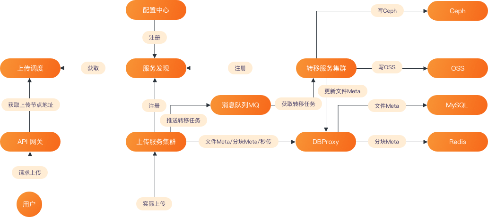

# Cloud Storage 基于微服务架构的分布式云存储系统

- 基础文件上传、秒传、分块上传和断点续传
- Ceph 集群和阿里云 OSS
- Rabbitmq 异步处理
- Consul 微服务
- Docker 容器化和 K8s 集群

 

 

## [1 启动用户服务](service/README.md)

## 目录
#### [config](../config)    配置文件
#### [configurator](../configurator)    配置文件解析器
#### [db](../db)    数据库
- [ceph](../db/ceph)
- [mysql](../db/mysql)
- [oss](../db/oss)
- [redis](../db/redis)
#### [file](../file)    用户文件
#### [handler](../handler)    路由服务函数
#### [rabbitmq](../rabbitmq)    消息队列 用于上传文件的异步处理
#### [router](../router)    路由
#### [run](run)    普通方式运行
#### [service](service)    微服务方式运行
#### [service](../service)    两个 main 函数
#### [static](../static)    静态资源
#### [test](../test)    测试文件

